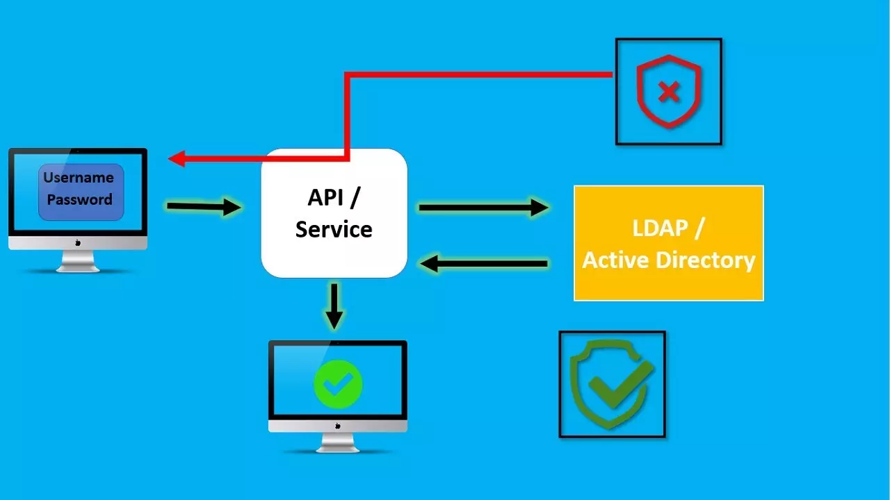
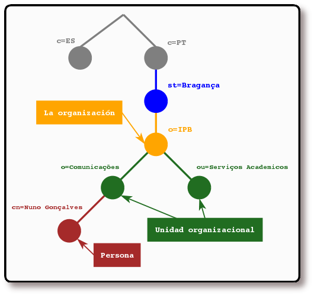
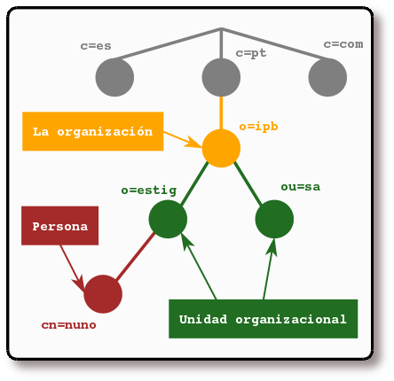

# Práctica 6.2 - Despliegue de servidores web con usuarios autenticados mediante LDAP usando *Docker* y *docker-compose*

## Introducción

### ¿Qué es un servicio de directorio LDAP? 

LDAP (Lightweight Directory Access Protocol) o también conocido como «Protocolo Ligero de Acceso a Directorios» es un protocolo de la capa de aplicación TCP/IP que permite el acceso a un servicio de directorio ordenado y distribuido, para buscar cualquier información en un entorno de red.

!!!note "Aclaración"
    Un directorio es un conjunto de objetos con atributos que están organizados de manera lógica y jerárquica, es decir, está en forma de árbol y perfectamente ordenado en función de lo que nosotros queramos, ya sea alfabéticamente, por usuarios, direcciones etc.

Generalmente un servidor LDAP se encarga de almacenar información de autenticación, es decir, el usuario y la contraseña, para posteriormente dar acceso a otro protocolo o servicio del sistema. Además de almacenar el nombre de usuario y la contraseña, también puede almacenar otra información como datos de contacto del usuario, ubicación de los recursos de la red local, certificados digitales de los propios usuarios y mucho más.

LDAP es un protocolo que nos permite acceder a los recursos de la red local, sin necesidad de crear los diferentes usuarios en el sistema operativo, además, es mucho más versátil. Por ejemplo, LDAP permite realizar tareas de autenticación y autorización a usuarios de diferentes softwares como Docker, OpenVPN, servidores de archivos como los usados por QNAP, Synology o ASUSTOR entre otros, y muchos más usos.

LDAP puede ser utilizado tanto por un usuario al que se pide unos  credenciales de acceso, como también por las aplicaciones para saber si tienen acceso a determinada información del sistema o no. Generalmente un servidor LDAP se encuentra en una red privada, es decir, redes de área local, para autenticar las diferentes aplicaciones y usuarios, pero también podría funcionar sobre redes públicas sin ningún problema.

!!!info
    En definitiva, LDAP nos proporciona un serivicio de autenticación y autorización para poder acceder a distintos recursos en red, como por ejemplo, a un sitio web. Si recordamos la práctica 2.2, nuestro usuario se autenticaba utilizando usuarios creados en el mismo sistema operativo (Debian Linux) donde se había instalado el servidor web Nginx.

    Tenemos, por tanto, la posibilidad de utilizar otra autenticación centralizada para el mismo cometido con LDAP.

### Implementaciones de LDAP

Microsoft Active Directory utiliza internamente el protocolo LDAP para realizar todas las comunicaciones desde los clientes hasta el servidor o servidores, por lo tanto, se encarga de que los clientes puedan autenticarse y acceder a cualquier dato almacenado, además, debemos tener en cuenta que este protocolo es multiplataforma, no solamente lo tenemos en sistemas operativos Windows sino que también es compatible con Linux, Unix y macOS, todo ello a través del protocolo. Para que os hagáis una idea, los siguientes servicios de directorio usan este protocolo para su comunicación:

+ Active Directory de Microsoft
+ Apache
+ Servicio de directorio de Red Hat
+ OpenLDAP

Y muchos otros servicios también lo usan, sobre todo el último, OpenLDAP, el cual es una implementación de código abierto del protocolo y que se puede instalar en cualquier sistema, ya que está disponible el código fuente para compilarlo. No obstante, en la mayoría de distribuciones de Linux lo tenemos disponible en sus repositorios.

### ¿Cómo se organiza la información en LDAP?

**En LDAP, las entradas están organizadas en una estructura jerárquica en árbol**. Tradicionalmente, esta estructura reflejaba los límites geográficos y organizacionales.

Las entradas que representan países aparecen en la parte superior del árbol. Debajo de ellos, están las entradas que representan los estados y las organizaciones nacionales. Debajo de estás, pueden estar las entradas que representan las unidades organizacionales, empleados, impresoras, documentos o todo aquello que pueda imaginarse. La siguiente figura muestra un ejemplo de un árbol de directorio LDAP haciendo uso del nombramiento tradicional.

El árbol también se puede organizar basándose en los nombres de dominio de Internet. Este tipo de nombramiento es muy popular, ya que permite localizar un servicio de directorio haciendo uso de los DNS. La siguiente figura muestra un ejemplo de un directorio LDAP que hace uso de los nombres basados en dominios.

#### ¿Cómo se referencia la información?

Una entrada es referenciada por su nombre distinguido (DN), que es construido por el nombre de la propia entrada (llamado Nombre Relativo Distinguido o RDN) y la concatenación de los nombres de las entradas que le anteceden. 

Por ejemplo, la entrada para Nuno Gonçalves en el ejemplo del nombramiento de Internet anterior tiene el siguiente RDN: uid=nuno y su DN sería: uid=nuno,ou=estig,dc=ipb,dc=pt.  

#### Cómo se accede a la información?

LDAP define operaciones para interrogar y actualizar el directorio. Provee operaciones para añadir y borrar entradas del directorio, modificar una entrada existente y cambiar el nombre de una entrada. La mayor parte del tiempo, sin embargo, LDAP se utiliza para buscar información almacenada en el directorio. Las operaciones de búsqueda de LDAP permiten buscar entradas que concuerdan con algún criterio especificado por un filtro de búsqueda. La información puede ser solicitada desde cada entrada que concuerda con dicho criterio.

Por ejemplo, imaginemos que queremos buscar en el subárbol del directorio que está por debajo de dc=ipb,dc=pt a personas con el nombre Nuno Gonçalves, obteniendo la dirección de correo electrónico de cada entrada que concuerde. LDAP permite hacer esto fácilmente. O tal vez preferimos buscar las organizaciones que posean la cadena IPB en su nombre, posean número de fax y estén debajo de la entrada st=Bragança,c=PT. LDAP permite hacer esto también.

LDAP ofrece una autenticación y autorización optimizadas y una búsqueda eficaz de datos de direcciones y de usuarios. Debido a sus muchas ventajas para las empresas. LDAP sirve a modo de un estándar de la industria y es compatible con la mayoría de los productos de software. Las ventajas principales son la rapidez de las consultas y conexiones, un lenguaje de consulta sencillo y un protocolo claramente estructurado

## Referencias

[Simple Docker/Apache/PHP Authentication with LDAP](https://medium.com/ihme-tech/simple-docker-apache-php-authentication-with-ldap-3ac16b17bf31)

[bitnami/nginx-ldap-auth-daemon](https://hub.docker.com/r/bitnami/nginx-ldap-auth-daemon)

[Para qué sirve el protocolo LDAP y cómo funciona](https://www.redeszone.net/tutoriales/servidores/que-es-ldap-funcionamiento/)

[OpenLDAP conceptos teóricos](https://www.sergio-gonzalez.com/doc/10-ldap-samba-cups-pykota/html/openldap-que-es.html)