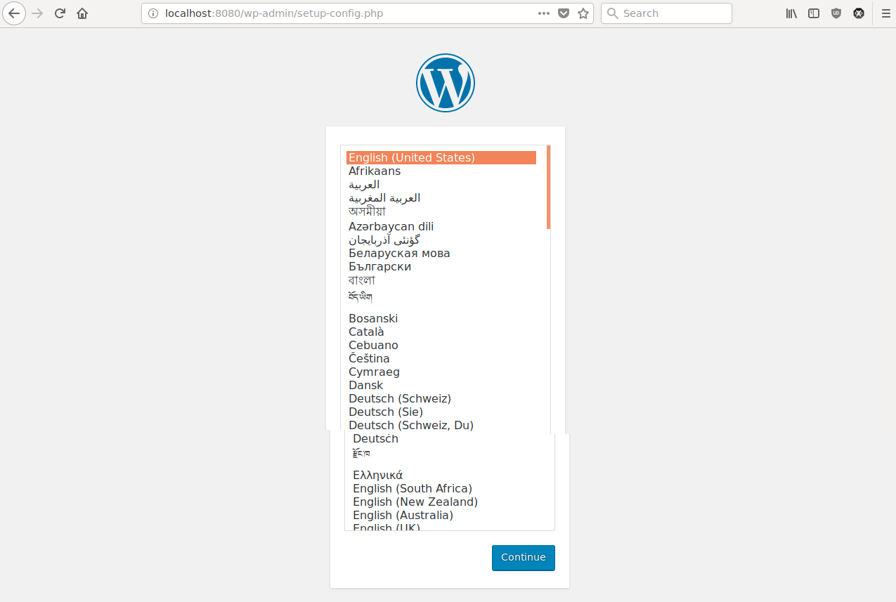

# Imágenes

Las imágenes son la base de Docker. Nuestros contenedores se iniciarán a partir de ellas. Como se indicó en la introducción, es una plantilla de solo lectura, que se crea incorporando los requisitos necesarios para cumplir el objetivo para el cual fue creada.

Por ejemplo, si estamos creando un proyecto con PHP, incorporará el intérprete del lenguaje de PHP. Si es una página web, incorporará el servidor web (_apache_, _nginx_, etc.).

## Buscar imágenes

Crear una imagen desde cero supone un esfuerzo demasiado grande, así que lo normal es partir o usar una ya creada.

Para ellos buscaremos en los registros, el lugar donde se almacenan. Hay un registro oficial ([https://hub.docker.com](https://hub.docker.com)), pero nada impide a otras organizaciones, o a nosotros mismo, tener un registro propio. Estos registros pueden ser privados o públicos.

Imaginemos que queremos crear una web con _WordPress_. Si buscamos en el registro encontraremos una imagen llamada _wordpress_, con la etiqueta oficial. La recomendación es que siempre busquemos imágenes oficiales, están mantenidas y bien documentadas.

En la página encontraremos las diferentes opciones que tiene esta imagen para configurarla, aunque las veremos con más detalle más adelante.

Por ahora iniciemos la imagen como se indica:

!!! example
    Iniciar una imagen de _WordPress_:

        docker run -p 8080:80 wordpress

Y comprobaremos como se inicia el contenedor:

```console hl_lines="1"
$ docker run -p 8080:80 wordpress
Unable to find image 'wordpress:latest' locally
latest: Pulling from library/wordpress
802b00ed6f79: Pull complete 
59f5a5a895f8: Pull complete 
6898b2dbcfeb: Pull complete 
8e0903aaa47e: Pull complete 
2961af1e196a: Pull complete 
71f7016f79a0: Pull complete 
5e1a48e5719c: Pull complete 
7ae5291984f3: Pull complete 
725b65166f31: Pull complete 
e90b121f9520: Pull complete 
b5a272809bbd: Pull complete 
f045f3ae0e2b: Pull complete 
7f51c9ea2d8e: Pull complete 
5aa9d0ed164a: Pull complete 
8eea44e2bfc7: Pull complete 
48918885026e: Pull complete 
8ac3e8ada01a: Pull complete 
d3da911b920f: Pull complete 
94c7e0af5b20: Pull complete 
e1f39ac90dec: Pull complete 
Digest: sha256:7121cdf8e9f01816653a3b2d2f4fc7bfe1dab956f00db5c7e7689e5f1454029a
Status: Downloaded newer image for wordpress:latest
WordPress not found in /var/www/html - copying now...
Complete! WordPress has been successfully copied to /var/www/html
AH00558: apache2: Could not reliably determine the server's fully qualified domain name,     using 10.17.0.1. Set the 'ServerName' directive globally to suppress this message
AH00558: apache2: Could not reliably determine the server's fully qualified domain name,     using 10.17.0.1. Set the 'ServerName' directive globally to suppress this message
[DDD mmm dd hh:mm:ss.iiiiii yyyy] [mpm_prefork:notice] [pid 1] AH00163: Apache/2.4.25     (Debian) PHP/7.2.10 configured -- resuming normal operations
[DDD mmm dd hh:mm:ss.iiiiii yyyy] [core:notice] [pid 1] AH00094: Command line: 'apache2     -D FOREGROUND'
```

Vemos en la línea nueva un nuevo parámetro: `-p 8080:80`. Por defecto, un contenedor está totalmente aislado. Pero si estamos montando un blog con _WordPress_ vamos a necesitar acceder a él desde el navegador.

Con el parámetro `-p`, versión corta de `--publish`, podemos indicar que estamos enlazando un puerto de la máquina anfitrión con el contenedor. En este caso estamos enlazando el puerto 8080 de la máquina anfitrión con el 80 del contenedor.

!!! info
    No vamos a explicar todas las opciones posibles, el tutorial sería demasiado largo. Puedes consultar la página del manual con `man docker-run` o llamando a la ayuda desde el cliente con `docker run --help`.

    En este caso, el formato de `publish` es:

    ```man
        -p, --publish ip:[hostPort]:containerPort | [hostPort:]containerPort
            Publish a container's port, or range of ports, to the host.

        Both hostPort and containerPort can be specified as a range.  When specifying ranges for both, the number of ports in ranges should be equal.

        Examples: -p 1234-1236:1222-1224, -p 127.0.0.1:$HOSTPORT:$CONTAINERPORT.

        Use docker port(1) to see the actual mapping, e.g. docker port CONTAINER $CONTAINERPORT.
    ```

Vamos a abrir la siguiente página web en nuestro navegador:

[http://localhost:8080](http://localhost:8080)

La cual nos mostrará el asistente de instalación de _WordPress_, el cual no vamos a instalar porque necesitamos una base de datos que aún no tenemos.



En su lugar vamos a la consola e interrumpimos la ejecución del contenedor con `Control+C`:

```console
^C[DDD mmm dd hh:mm:ss.iiiiii yyyy] [mpm_prefork:notice] [pid 1] AH00169: caught SIGTERM, shutting down
```

## Gestión de imágenes

### Descarga

Las imagenes que nos descargamos se identifican, además de por el nombre, por una versión. De esa manera podemos tener distintas versiones de una misma imagen. En la página del registro de _WordPress_ veremos una pestaña con el nombre _Tags_, con las versiones disponibles.

Para usar una en concreto se usa dos puntos seguido del nombre de la versión. Si no se indica nada, como hasta ahora, por defecto se descarga la etiquetada como _latest_.

Podemos descargar imágenes con la orden `docker pull`:

```console
$ docker pull wordpress:latest
latest: Pulling from library/wordpress
Digest: sha256:7121cdf8e9f01816653a3b2d2f4fc7bfe1dab956f00db5c7e7689e5f1454029a
Status: Image is up to date for wordpress:latest

$  docker pull wordpress:php7.1
php7.1: Pulling from library/wordpress
802b00ed6f79: Already exists 
59f5a5a895f8: Already exists 
6898b2dbcfeb: Already exists 
8e0903aaa47e: Already exists 
2961af1e196a: Already exists 
71f7016f79a0: Already exists 
5e1a48e5719c: Already exists 
7ae5291984f3: Already exists 
725b65166f31: Already exists 
a2d738459b49: Pull complete 
24830994a3eb: Pull complete 
b3807dc98c17: Pull complete 
59365c2968b5: Pull complete 
36bea53859bb: Pull complete 
a777908b01b4: Pull complete 
bd3efa4fff20: Pull complete 
662f2add84f7: Pull complete 
4340a5e4d9f8: Pull complete 
2dbeaf456768: Pull complete 
Digest: sha256:2cc529d3d4ac538f8565d18a893bd1308d6f5522422f4696d87267695f69702c
Status: Downloaded newer image for wordpress:php7.1
```

En el primer caso no hay descarga porque esa versión ya estaba descargada, en la segunda nos descargamos la versión de la imagen que usa php7.1 en vez de php7.2

### Listado

Para ver el listado de images disponibles usamos `docker images`:

```console
$ docker images
REPOSITORY   TAG     IMAGE ID      CREATED      SIZE
wordpress    latest  ca0fefec932b  7 days ago   409MB
wordpress    php7.1  37664bd9863e  7 days ago   400MB
hello-world  latest  4ab4c602aa5e  2 weeks ago  1.84kB
```
### Borrado

Si queremos dejar de usar alguna imagen usaremos `docker rmi`:

```console
$ docker rmi wordpress:php7.1 
Untagged: wordpress:php7.1
Untagged: wordpress@sha256:2cc529d3d4ac538f8565d18a893bd1308d6f5522422f4696d87267695f69702c
Deleted: sha256:37664bd9863efe67a83cb2ff293f1816a9b5f918668ae19ca36b2af3d3b9f62d
Deleted: sha256:77c97f008777c89455c8e5f248a626b192b62cf07ed1993c9acdfab73be210ee
Deleted: sha256:14f58345b0bb2efaede03f9424412dce141ea275343305a79952c9c8bda3d1ba
Deleted: sha256:5902e2becea5be6d672e8a6a84cc66a2f3b8e1b209302a9995de2b9afac8535f
Deleted: sha256:a5b592bce0a767eed15cce29e5e4a941341a0b8de1633ab8836079c03af31b9e
Deleted: sha256:6cc2318a4f6975aa87358d9f2852d8b91b335515a1d42ef141af368ee0b6fc05
Deleted: sha256:c3c8b98ead26315e76cd9625fd59f67cab81afa7810b84a229f4e612097a3db4
Deleted: sha256:a641d6d5a4f43b035946f9a82c9f126189e8502567bb17c41d25e922a5b314a3
Deleted: sha256:a7338078acb6f6e8b1a152dabd6e7e47b3e530e1f2e2169b8b69127c9578f8fe
Deleted: sha256:8f416a21cdea7d5b42d6b799ab4ade2dffe1f6a3b9d83dd02be47a82699922de
Deleted: sha256:53862f425fbc706f70bd1238a0e929bf6d648547481acfad4910c4c1bde39b95
```

!!! warning
    Si una imagen está en uso por algún contenedor, no nos dejará eliminarla.

    ``` console
    $ docker rmi hello-world:latest
    Error response from daemon: conflict: unable to remove repository reference "hello-world:latest" (must force) - container 5ae8bbb8768d is using its referenced image 4ab4c602aa5e
    ```
